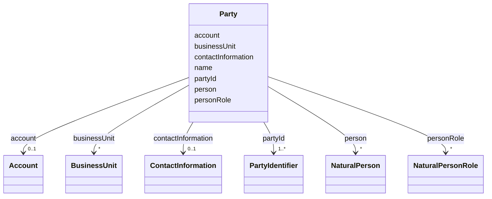

```mermaid
 classDiagram
    class Party
    click Party href "../Party"
      Party : account
        
          
    
        
        
        Party --> "0..1" Account : account
        click Account href "../Account"
    

        
      Party : businessUnit
        
          
    
        
        
        Party --> "*" BusinessUnit : businessUnit
        click BusinessUnit href "../BusinessUnit"
    

        
      Party : contactInformation
        
          
    
        
        
        Party --> "0..1" ContactInformation : contactInformation
        click ContactInformation href "../ContactInformation"
    

        
      Party : name
        
      Party : partyId
        
          
    
        
        
        Party --> "1..*" PartyIdentifier : partyId
        click PartyIdentifier href "../PartyIdentifier"
    

        
      Party : person
        
          
    
        
        
        Party --> "*" NaturalPerson : person
        click NaturalPerson href "../NaturalPerson"
    

        
      Party : personRole
        
          
    
        
        
        Party --> "*" NaturalPersonRole : personRole
        click NaturalPersonRole href "../NaturalPersonRole"
    

        
      
```
