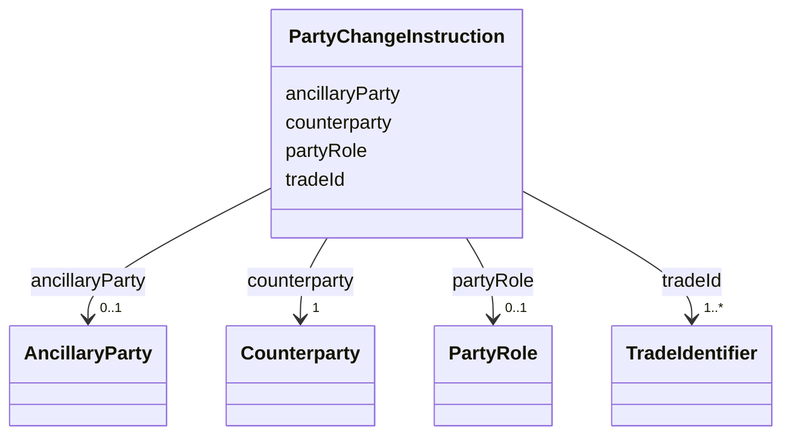

```mermaid
 classDiagram
    class PartyChangeInstruction
    click PartyChangeInstruction href "../PartyChangeInstruction"
      PartyChangeInstruction : ancillaryParty
        
          
    
        
        
        PartyChangeInstruction --> "0..1" AncillaryParty : ancillaryParty
        click AncillaryParty href "../AncillaryParty"
    

        
      PartyChangeInstruction : counterparty
        
          
    
        
        
        PartyChangeInstruction --> "1" Counterparty : counterparty
        click Counterparty href "../Counterparty"
    

        
      PartyChangeInstruction : partyRole
        
          
    
        
        
        PartyChangeInstruction --> "0..1" PartyRole : partyRole
        click PartyRole href "../PartyRole"
    

        
      PartyChangeInstruction : tradeId
        
          
    
        
        
        PartyChangeInstruction --> "1..*" TradeIdentifier : tradeId
        click TradeIdentifier href "../TradeIdentifier"
    

        
      
```
