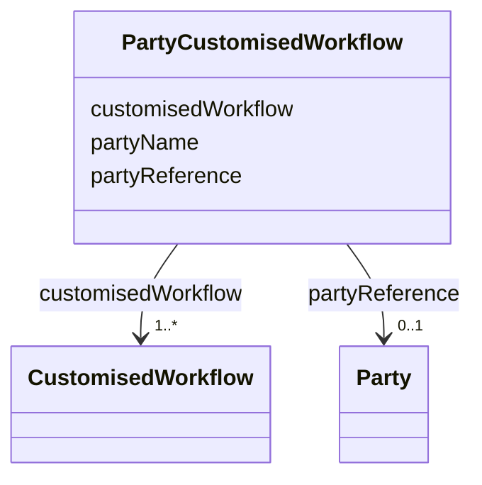

```mermaid
 classDiagram
    class PartyCustomisedWorkflow
    click PartyCustomisedWorkflow href "../PartyCustomisedWorkflow"
      PartyCustomisedWorkflow : customisedWorkflow
        
          
    
        
        
        PartyCustomisedWorkflow --> "1..*" CustomisedWorkflow : customisedWorkflow
        click CustomisedWorkflow href "../CustomisedWorkflow"
    

        
      PartyCustomisedWorkflow : partyName
        
      PartyCustomisedWorkflow : partyReference
        
          
    
        
        
        PartyCustomisedWorkflow --> "0..1" Party : partyReference
        click Party href "../Party"
    

        
      
```
