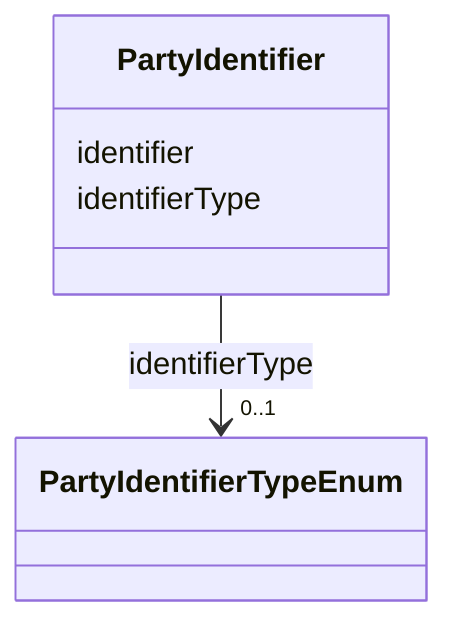

```mermaid
 classDiagram
    class PartyIdentifier
    click PartyIdentifier href "../PartyIdentifier"
      PartyIdentifier : identifier
        
      PartyIdentifier : identifierType
        
          
    
        
        
        PartyIdentifier --> "0..1" PartyIdentifierTypeEnum : identifierType
        click PartyIdentifierTypeEnum href "../PartyIdentifierTypeEnum"
    

        
      
```
