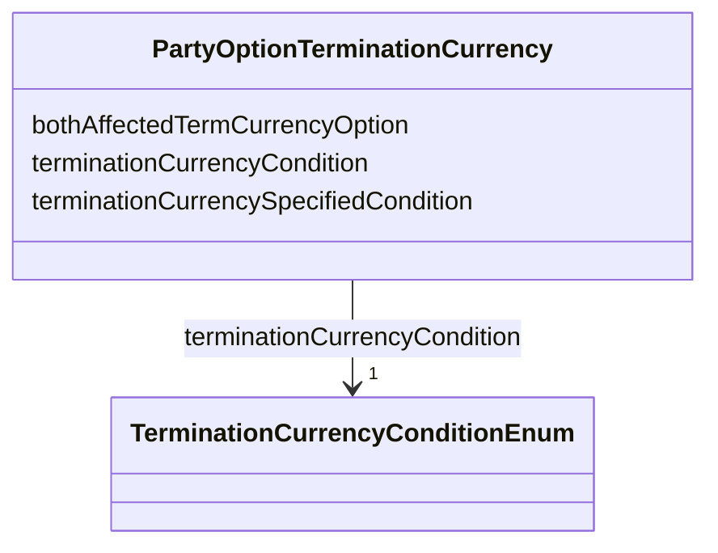

```mermaid
 classDiagram
    class PartyOptionTerminationCurrency
    click PartyOptionTerminationCurrency href "../PartyOptionTerminationCurrency"
      PartyOptionTerminationCurrency : bothAffectedTermCurrencyOption
        
      PartyOptionTerminationCurrency : terminationCurrencyCondition
        
          
    
        
        
        PartyOptionTerminationCurrency --> "1" TerminationCurrencyConditionEnum : terminationCurrencyCondition
        click TerminationCurrencyConditionEnum href "../TerminationCurrencyConditionEnum"
    

        
      PartyOptionTerminationCurrency : terminationCurrencySpecifiedCondition
        
      
```
