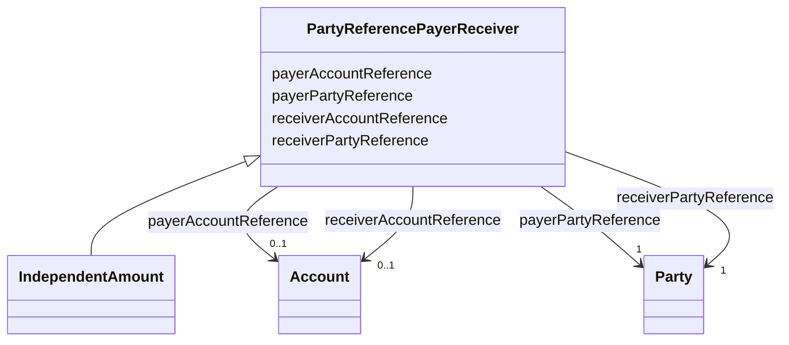

```mermaid
 classDiagram
    class PartyReferencePayerReceiver
    click PartyReferencePayerReceiver href "../PartyReferencePayerReceiver"
      PartyReferencePayerReceiver <|-- IndependentAmount
        click IndependentAmount href "../IndependentAmount"
      
      PartyReferencePayerReceiver : payerAccountReference
        
          
    
        
        
        PartyReferencePayerReceiver --> "0..1" Account : payerAccountReference
        click Account href "../Account"
    

        
      PartyReferencePayerReceiver : payerPartyReference
        
          
    
        
        
        PartyReferencePayerReceiver --> "1" Party : payerPartyReference
        click Party href "../Party"
    

        
      PartyReferencePayerReceiver : receiverAccountReference
        
          
    
        
        
        PartyReferencePayerReceiver --> "0..1" Account : receiverAccountReference
        click Account href "../Account"
    

        
      PartyReferencePayerReceiver : receiverPartyReference
        
          
    
        
        
        PartyReferencePayerReceiver --> "1" Party : receiverPartyReference
        click Party href "../Party"
    

        
      
```
