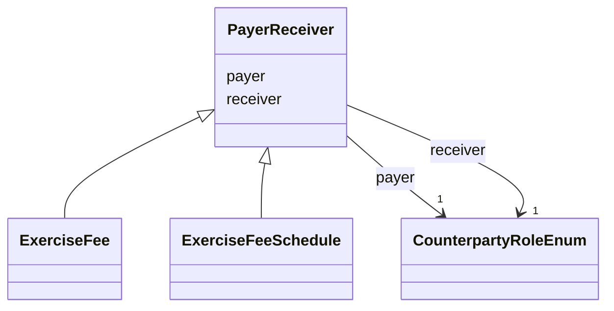

```mermaid
 classDiagram
    class PayerReceiver
    click PayerReceiver href "../PayerReceiver"
      PayerReceiver <|-- ExerciseFee
        click ExerciseFee href "../ExerciseFee"
      PayerReceiver <|-- ExerciseFeeSchedule
        click ExerciseFeeSchedule href "../ExerciseFeeSchedule"
      
      PayerReceiver : payer
        
          
    
        
        
        PayerReceiver --> "1" CounterpartyRoleEnum : payer
        click CounterpartyRoleEnum href "../CounterpartyRoleEnum"
    

        
      PayerReceiver : receiver
        
          
    
        
        
        PayerReceiver --> "1" CounterpartyRoleEnum : receiver
        click CounterpartyRoleEnum href "../CounterpartyRoleEnum"
    

        
      
```
