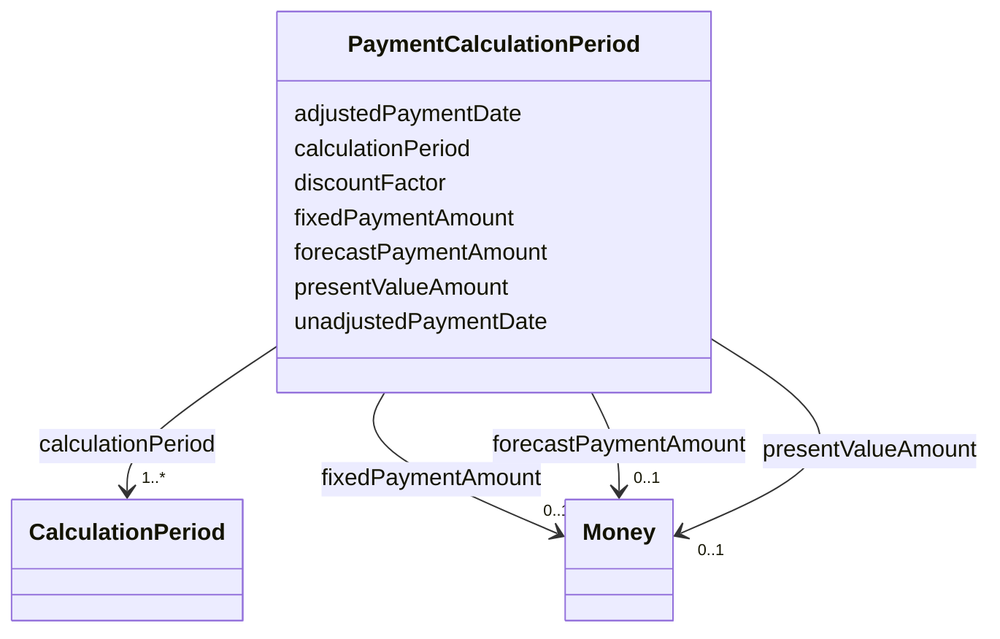

```mermaid
 classDiagram
    class PaymentCalculationPeriod
    click PaymentCalculationPeriod href "../PaymentCalculationPeriod"
      PaymentCalculationPeriod : adjustedPaymentDate
        
      PaymentCalculationPeriod : calculationPeriod
        
          
    
        
        
        PaymentCalculationPeriod --> "1..*" CalculationPeriod : calculationPeriod
        click CalculationPeriod href "../CalculationPeriod"
    

        
      PaymentCalculationPeriod : discountFactor
        
      PaymentCalculationPeriod : fixedPaymentAmount
        
          
    
        
        
        PaymentCalculationPeriod --> "0..1" Money : fixedPaymentAmount
        click Money href "../Money"
    

        
      PaymentCalculationPeriod : forecastPaymentAmount
        
          
    
        
        
        PaymentCalculationPeriod --> "0..1" Money : forecastPaymentAmount
        click Money href "../Money"
    

        
      PaymentCalculationPeriod : presentValueAmount
        
          
    
        
        
        PaymentCalculationPeriod --> "0..1" Money : presentValueAmount
        click Money href "../Money"
    

        
      PaymentCalculationPeriod : unadjustedPaymentDate
        
      
```
