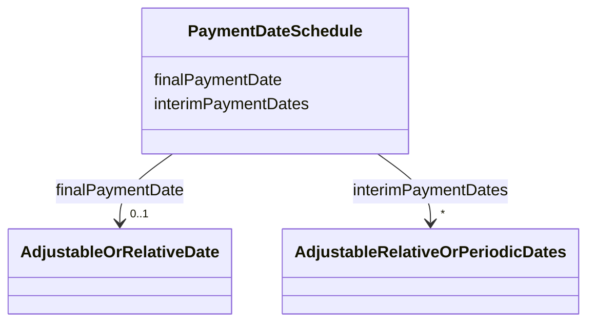

```mermaid
 classDiagram
    class PaymentDateSchedule
    click PaymentDateSchedule href "../PaymentDateSchedule"
      PaymentDateSchedule : finalPaymentDate
        
          
    
        
        
        PaymentDateSchedule --> "0..1" AdjustableOrRelativeDate : finalPaymentDate
        click AdjustableOrRelativeDate href "../AdjustableOrRelativeDate"
    

        
      PaymentDateSchedule : interimPaymentDates
        
          
    
        
        
        PaymentDateSchedule --> "*" AdjustableRelativeOrPeriodicDates : interimPaymentDates
        click AdjustableRelativeOrPeriodicDates href "../AdjustableRelativeOrPeriodicDates"
    

        
      
```
