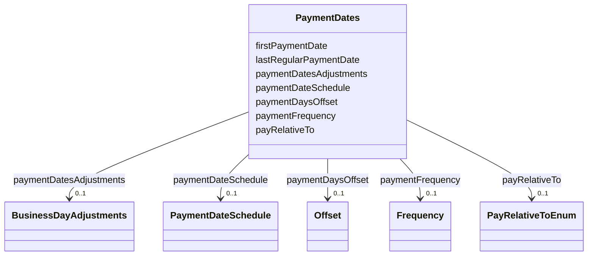

```mermaid
 classDiagram
    class PaymentDates
    click PaymentDates href "../PaymentDates"
      PaymentDates : firstPaymentDate
        
      PaymentDates : lastRegularPaymentDate
        
      PaymentDates : paymentDatesAdjustments
        
          
    
        
        
        PaymentDates --> "0..1" BusinessDayAdjustments : paymentDatesAdjustments
        click BusinessDayAdjustments href "../BusinessDayAdjustments"
    

        
      PaymentDates : paymentDateSchedule
        
          
    
        
        
        PaymentDates --> "0..1" PaymentDateSchedule : paymentDateSchedule
        click PaymentDateSchedule href "../PaymentDateSchedule"
    

        
      PaymentDates : paymentDaysOffset
        
          
    
        
        
        PaymentDates --> "0..1" Offset : paymentDaysOffset
        click Offset href "../Offset"
    

        
      PaymentDates : paymentFrequency
        
          
    
        
        
        PaymentDates --> "0..1" Frequency : paymentFrequency
        click Frequency href "../Frequency"
    

        
      PaymentDates : payRelativeTo
        
          
    
        
        
        PaymentDates --> "0..1" PayRelativeToEnum : payRelativeTo
        click PayRelativeToEnum href "../PayRelativeToEnum"
    

        
      
```
