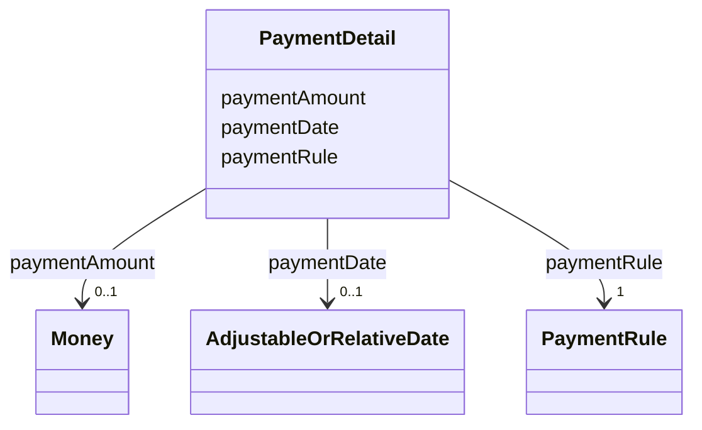

```mermaid
 classDiagram
    class PaymentDetail
    click PaymentDetail href "../PaymentDetail"
      PaymentDetail : paymentAmount
        
          
    
        
        
        PaymentDetail --> "0..1" Money : paymentAmount
        click Money href "../Money"
    

        
      PaymentDetail : paymentDate
        
          
    
        
        
        PaymentDetail --> "0..1" AdjustableOrRelativeDate : paymentDate
        click AdjustableOrRelativeDate href "../AdjustableOrRelativeDate"
    

        
      PaymentDetail : paymentRule
        
          
    
        
        
        PaymentDetail --> "1" PaymentRule : paymentRule
        click PaymentRule href "../PaymentRule"
    

        
      
```
