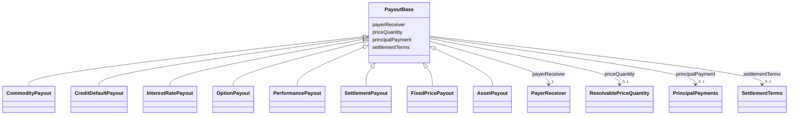

```mermaid
 classDiagram
    class PayoutBase
    click PayoutBase href "../PayoutBase"
      PayoutBase <|-- CommodityPayout
        click CommodityPayout href "../CommodityPayout"
      PayoutBase <|-- CreditDefaultPayout
        click CreditDefaultPayout href "../CreditDefaultPayout"
      PayoutBase <|-- InterestRatePayout
        click InterestRatePayout href "../InterestRatePayout"
      PayoutBase <|-- OptionPayout
        click OptionPayout href "../OptionPayout"
      PayoutBase <|-- PerformancePayout
        click PerformancePayout href "../PerformancePayout"
      PayoutBase <|-- SettlementPayout
        click SettlementPayout href "../SettlementPayout"
      PayoutBase <|-- FixedPricePayout
        click FixedPricePayout href "../FixedPricePayout"
      PayoutBase <|-- AssetPayout
        click AssetPayout href "../AssetPayout"
      
      PayoutBase : payerReceiver
        
          
    
        
        
        PayoutBase --> "1" PayerReceiver : payerReceiver
        click PayerReceiver href "../PayerReceiver"
    

        
      PayoutBase : priceQuantity
        
          
    
        
        
        PayoutBase --> "0..1" ResolvablePriceQuantity : priceQuantity
        click ResolvablePriceQuantity href "../ResolvablePriceQuantity"
    

        
      PayoutBase : principalPayment
        
          
    
        
        
        PayoutBase --> "0..1" PrincipalPayments : principalPayment
        click PrincipalPayments href "../PrincipalPayments"
    

        
      PayoutBase : settlementTerms
        
          
    
        
        
        PayoutBase --> "0..1" SettlementTerms : settlementTerms
        click SettlementTerms href "../SettlementTerms"
    

        
      
```
