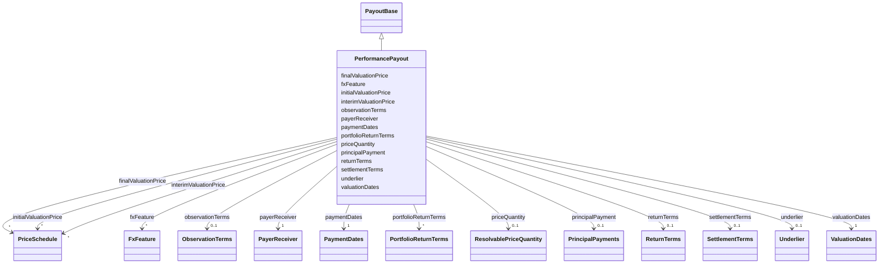

```mermaid
 classDiagram
    class PerformancePayout
    click PerformancePayout href "../PerformancePayout"
      PayoutBase <|-- PerformancePayout
        click PayoutBase href "../PayoutBase"
      
      PerformancePayout : finalValuationPrice
        
          
    
        
        
        PerformancePayout --> "*" PriceSchedule : finalValuationPrice
        click PriceSchedule href "../PriceSchedule"
    

        
      PerformancePayout : fxFeature
        
          
    
        
        
        PerformancePayout --> "*" FxFeature : fxFeature
        click FxFeature href "../FxFeature"
    

        
      PerformancePayout : initialValuationPrice
        
          
    
        
        
        PerformancePayout --> "*" PriceSchedule : initialValuationPrice
        click PriceSchedule href "../PriceSchedule"
    

        
      PerformancePayout : interimValuationPrice
        
          
    
        
        
        PerformancePayout --> "*" PriceSchedule : interimValuationPrice
        click PriceSchedule href "../PriceSchedule"
    

        
      PerformancePayout : observationTerms
        
          
    
        
        
        PerformancePayout --> "0..1" ObservationTerms : observationTerms
        click ObservationTerms href "../ObservationTerms"
    

        
      PerformancePayout : payerReceiver
        
          
    
        
        
        PerformancePayout --> "1" PayerReceiver : payerReceiver
        click PayerReceiver href "../PayerReceiver"
    

        
      PerformancePayout : paymentDates
        
          
    
        
        
        PerformancePayout --> "1" PaymentDates : paymentDates
        click PaymentDates href "../PaymentDates"
    

        
      PerformancePayout : portfolioReturnTerms
        
          
    
        
        
        PerformancePayout --> "*" PortfolioReturnTerms : portfolioReturnTerms
        click PortfolioReturnTerms href "../PortfolioReturnTerms"
    

        
      PerformancePayout : priceQuantity
        
          
    
        
        
        PerformancePayout --> "0..1" ResolvablePriceQuantity : priceQuantity
        click ResolvablePriceQuantity href "../ResolvablePriceQuantity"
    

        
      PerformancePayout : principalPayment
        
          
    
        
        
        PerformancePayout --> "0..1" PrincipalPayments : principalPayment
        click PrincipalPayments href "../PrincipalPayments"
    

        
      PerformancePayout : returnTerms
        
          
    
        
        
        PerformancePayout --> "0..1" ReturnTerms : returnTerms
        click ReturnTerms href "../ReturnTerms"
    

        
      PerformancePayout : settlementTerms
        
          
    
        
        
        PerformancePayout --> "0..1" SettlementTerms : settlementTerms
        click SettlementTerms href "../SettlementTerms"
    

        
      PerformancePayout : underlier
        
          
    
        
        
        PerformancePayout --> "0..1" Underlier : underlier
        click Underlier href "../Underlier"
    

        
      PerformancePayout : valuationDates
        
          
    
        
        
        PerformancePayout --> "1" ValuationDates : valuationDates
        click ValuationDates href "../ValuationDates"
    

        
      
```
