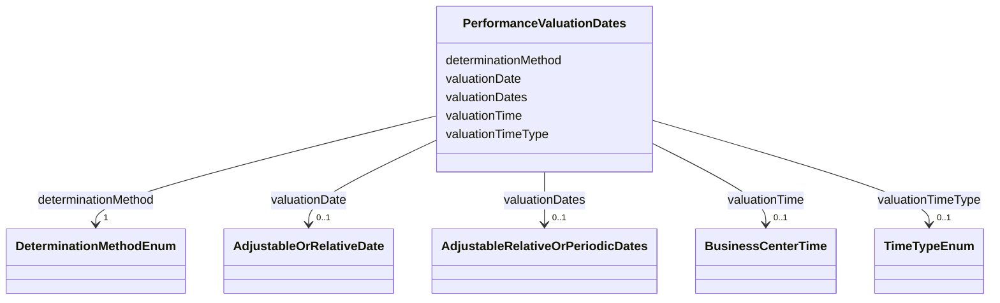

```mermaid
 classDiagram
    class PerformanceValuationDates
    click PerformanceValuationDates href "../PerformanceValuationDates"
      PerformanceValuationDates : determinationMethod
        
          
    
        
        
        PerformanceValuationDates --> "1" DeterminationMethodEnum : determinationMethod
        click DeterminationMethodEnum href "../DeterminationMethodEnum"
    

        
      PerformanceValuationDates : valuationDate
        
          
    
        
        
        PerformanceValuationDates --> "0..1" AdjustableOrRelativeDate : valuationDate
        click AdjustableOrRelativeDate href "../AdjustableOrRelativeDate"
    

        
      PerformanceValuationDates : valuationDates
        
          
    
        
        
        PerformanceValuationDates --> "0..1" AdjustableRelativeOrPeriodicDates : valuationDates
        click AdjustableRelativeOrPeriodicDates href "../AdjustableRelativeOrPeriodicDates"
    

        
      PerformanceValuationDates : valuationTime
        
          
    
        
        
        PerformanceValuationDates --> "0..1" BusinessCenterTime : valuationTime
        click BusinessCenterTime href "../BusinessCenterTime"
    

        
      PerformanceValuationDates : valuationTimeType
        
          
    
        
        
        PerformanceValuationDates --> "0..1" TimeTypeEnum : valuationTimeType
        click TimeTypeEnum href "../TimeTypeEnum"
    

        
      
```
