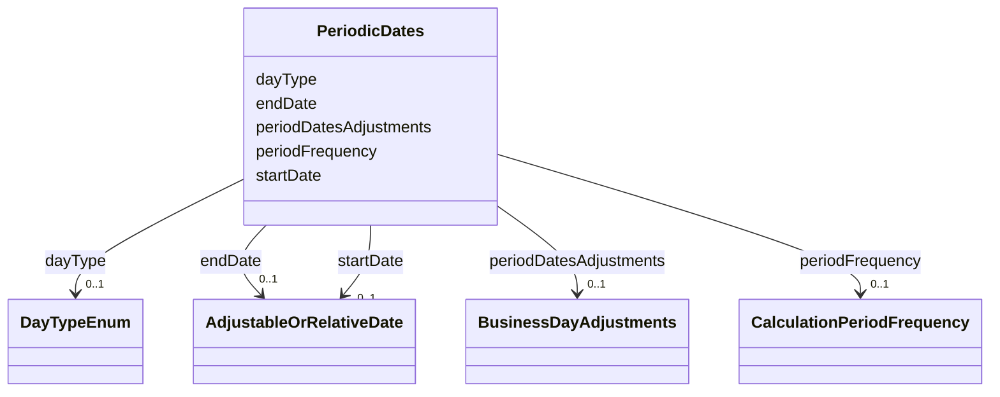

```mermaid
 classDiagram
    class PeriodicDates
    click PeriodicDates href "../PeriodicDates"
      PeriodicDates : dayType
        
          
    
        
        
        PeriodicDates --> "0..1" DayTypeEnum : dayType
        click DayTypeEnum href "../DayTypeEnum"
    

        
      PeriodicDates : endDate
        
          
    
        
        
        PeriodicDates --> "0..1" AdjustableOrRelativeDate : endDate
        click AdjustableOrRelativeDate href "../AdjustableOrRelativeDate"
    

        
      PeriodicDates : periodDatesAdjustments
        
          
    
        
        
        PeriodicDates --> "0..1" BusinessDayAdjustments : periodDatesAdjustments
        click BusinessDayAdjustments href "../BusinessDayAdjustments"
    

        
      PeriodicDates : periodFrequency
        
          
    
        
        
        PeriodicDates --> "0..1" CalculationPeriodFrequency : periodFrequency
        click CalculationPeriodFrequency href "../CalculationPeriodFrequency"
    

        
      PeriodicDates : startDate
        
          
    
        
        
        PeriodicDates --> "0..1" AdjustableOrRelativeDate : startDate
        click AdjustableOrRelativeDate href "../AdjustableOrRelativeDate"
    

        
      
```
