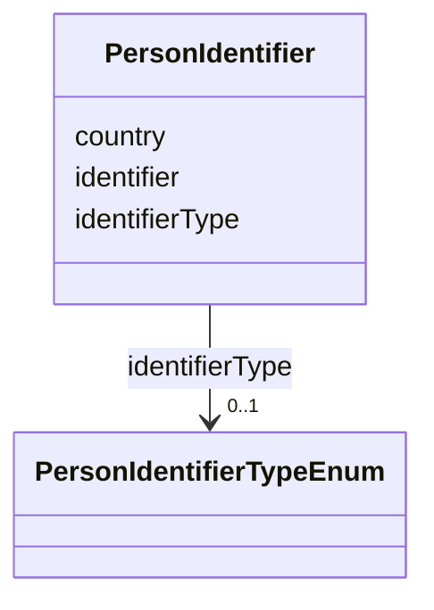

```mermaid
 classDiagram
    class PersonIdentifier
    click PersonIdentifier href "../PersonIdentifier"
      PersonIdentifier : country
        
      PersonIdentifier : identifier
        
      PersonIdentifier : identifierType
        
          
    
        
        
        PersonIdentifier --> "0..1" PersonIdentifierTypeEnum : identifierType
        click PersonIdentifierTypeEnum href "../PersonIdentifierTypeEnum"
    

        
      
```
