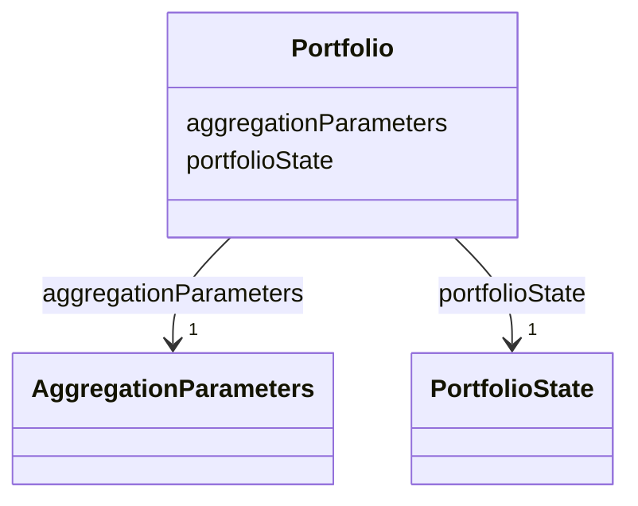

```mermaid
 classDiagram
    class Portfolio
    click Portfolio href "../Portfolio"
      Portfolio : aggregationParameters
        
          
    
        
        
        Portfolio --> "1" AggregationParameters : aggregationParameters
        click AggregationParameters href "../AggregationParameters"
    

        
      Portfolio : portfolioState
        
          
    
        
        
        Portfolio --> "1" PortfolioState : portfolioState
        click PortfolioState href "../PortfolioState"
    

        
      
```
