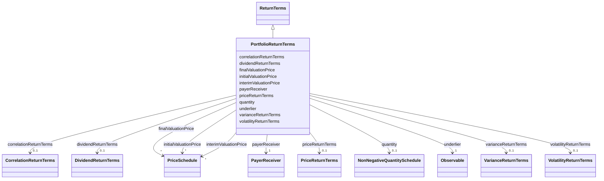

```mermaid
 classDiagram
    class PortfolioReturnTerms
    click PortfolioReturnTerms href "../PortfolioReturnTerms"
      ReturnTerms <|-- PortfolioReturnTerms
        click ReturnTerms href "../ReturnTerms"
      
      PortfolioReturnTerms : correlationReturnTerms
        
          
    
        
        
        PortfolioReturnTerms --> "0..1" CorrelationReturnTerms : correlationReturnTerms
        click CorrelationReturnTerms href "../CorrelationReturnTerms"
    

        
      PortfolioReturnTerms : dividendReturnTerms
        
          
    
        
        
        PortfolioReturnTerms --> "0..1" DividendReturnTerms : dividendReturnTerms
        click DividendReturnTerms href "../DividendReturnTerms"
    

        
      PortfolioReturnTerms : finalValuationPrice
        
          
    
        
        
        PortfolioReturnTerms --> "*" PriceSchedule : finalValuationPrice
        click PriceSchedule href "../PriceSchedule"
    

        
      PortfolioReturnTerms : initialValuationPrice
        
          
    
        
        
        PortfolioReturnTerms --> "*" PriceSchedule : initialValuationPrice
        click PriceSchedule href "../PriceSchedule"
    

        
      PortfolioReturnTerms : interimValuationPrice
        
          
    
        
        
        PortfolioReturnTerms --> "*" PriceSchedule : interimValuationPrice
        click PriceSchedule href "../PriceSchedule"
    

        
      PortfolioReturnTerms : payerReceiver
        
          
    
        
        
        PortfolioReturnTerms --> "1" PayerReceiver : payerReceiver
        click PayerReceiver href "../PayerReceiver"
    

        
      PortfolioReturnTerms : priceReturnTerms
        
          
    
        
        
        PortfolioReturnTerms --> "0..1" PriceReturnTerms : priceReturnTerms
        click PriceReturnTerms href "../PriceReturnTerms"
    

        
      PortfolioReturnTerms : quantity
        
          
    
        
        
        PortfolioReturnTerms --> "0..1" NonNegativeQuantitySchedule : quantity
        click NonNegativeQuantitySchedule href "../NonNegativeQuantitySchedule"
    

        
      PortfolioReturnTerms : underlier
        
          
    
        
        
        PortfolioReturnTerms --> "1" Observable : underlier
        click Observable href "../Observable"
    

        
      PortfolioReturnTerms : varianceReturnTerms
        
          
    
        
        
        PortfolioReturnTerms --> "0..1" VarianceReturnTerms : varianceReturnTerms
        click VarianceReturnTerms href "../VarianceReturnTerms"
    

        
      PortfolioReturnTerms : volatilityReturnTerms
        
          
    
        
        
        PortfolioReturnTerms --> "0..1" VolatilityReturnTerms : volatilityReturnTerms
        click VolatilityReturnTerms href "../VolatilityReturnTerms"
    

        
      
```
