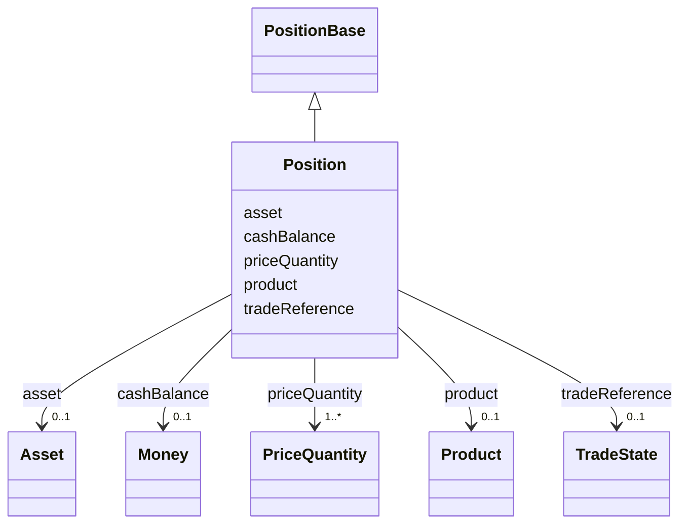

```mermaid
 classDiagram
    class Position
    click Position href "../Position"
      PositionBase <|-- Position
        click PositionBase href "../PositionBase"
      
      Position : asset
        
          
    
        
        
        Position --> "0..1" Asset : asset
        click Asset href "../Asset"
    

        
      Position : cashBalance
        
          
    
        
        
        Position --> "0..1" Money : cashBalance
        click Money href "../Money"
    

        
      Position : priceQuantity
        
          
    
        
        
        Position --> "1..*" PriceQuantity : priceQuantity
        click PriceQuantity href "../PriceQuantity"
    

        
      Position : product
        
          
    
        
        
        Position --> "0..1" Product : product
        click Product href "../Product"
    

        
      Position : tradeReference
        
          
    
        
        
        Position --> "0..1" TradeState : tradeReference
        click TradeState href "../TradeState"
    

        
      
```
