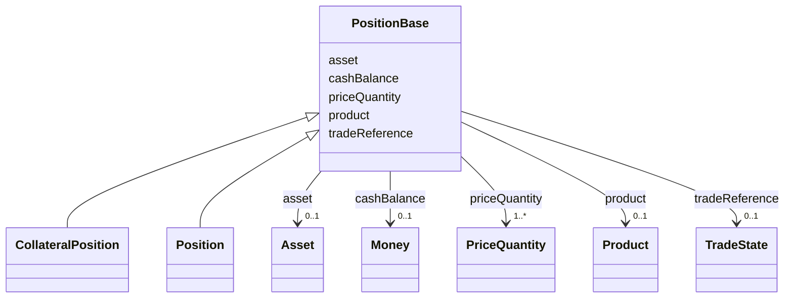

```mermaid
 classDiagram
    class PositionBase
    click PositionBase href "../PositionBase"
      PositionBase <|-- CollateralPosition
        click CollateralPosition href "../CollateralPosition"
      PositionBase <|-- Position
        click Position href "../Position"
      
      PositionBase : asset
        
          
    
        
        
        PositionBase --> "0..1" Asset : asset
        click Asset href "../Asset"
    

        
      PositionBase : cashBalance
        
          
    
        
        
        PositionBase --> "0..1" Money : cashBalance
        click Money href "../Money"
    

        
      PositionBase : priceQuantity
        
          
    
        
        
        PositionBase --> "1..*" PriceQuantity : priceQuantity
        click PriceQuantity href "../PriceQuantity"
    

        
      PositionBase : product
        
          
    
        
        
        PositionBase --> "0..1" Product : product
        click Product href "../Product"
    

        
      PositionBase : tradeReference
        
          
    
        
        
        PositionBase --> "0..1" TradeState : tradeReference
        click TradeState href "../TradeState"
    

        
      
```
