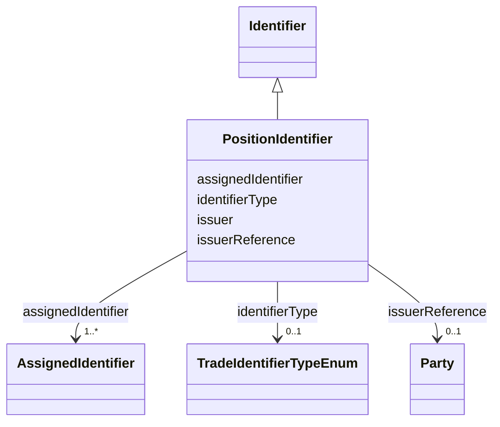

```mermaid
 classDiagram
    class PositionIdentifier
    click PositionIdentifier href "../PositionIdentifier"
      Identifier <|-- PositionIdentifier
        click Identifier href "../Identifier"
      
      PositionIdentifier : assignedIdentifier
        
          
    
        
        
        PositionIdentifier --> "1..*" AssignedIdentifier : assignedIdentifier
        click AssignedIdentifier href "../AssignedIdentifier"
    

        
      PositionIdentifier : identifierType
        
          
    
        
        
        PositionIdentifier --> "0..1" TradeIdentifierTypeEnum : identifierType
        click TradeIdentifierTypeEnum href "../TradeIdentifierTypeEnum"
    

        
      PositionIdentifier : issuer
        
      PositionIdentifier : issuerReference
        
          
    
        
        
        PositionIdentifier --> "0..1" Party : issuerReference
        click Party href "../Party"
    

        
      
```
