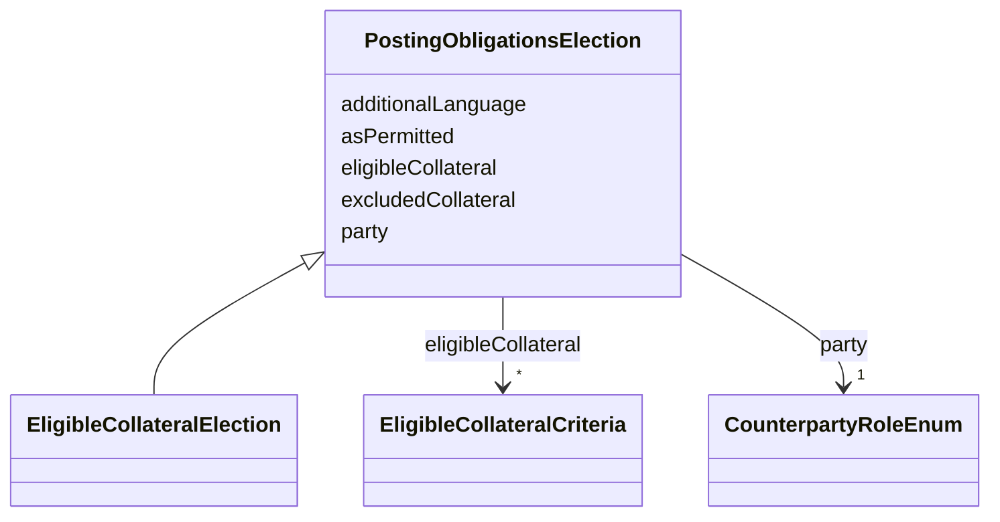

```mermaid
 classDiagram
    class PostingObligationsElection
    click PostingObligationsElection href "../PostingObligationsElection"
      PostingObligationsElection <|-- EligibleCollateralElection
        click EligibleCollateralElection href "../EligibleCollateralElection"
      
      PostingObligationsElection : additionalLanguage
        
      PostingObligationsElection : asPermitted
        
      PostingObligationsElection : eligibleCollateral
        
          
    
        
        
        PostingObligationsElection --> "*" EligibleCollateralCriteria : eligibleCollateral
        click EligibleCollateralCriteria href "../EligibleCollateralCriteria"
    

        
      PostingObligationsElection : excludedCollateral
        
      PostingObligationsElection : party
        
          
    
        
        
        PostingObligationsElection --> "1" CounterpartyRoleEnum : party
        click CounterpartyRoleEnum href "../CounterpartyRoleEnum"
    

        
      
```
