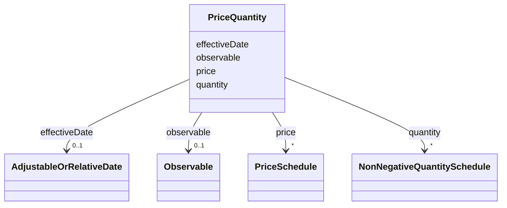

```mermaid
 classDiagram
    class PriceQuantity
    click PriceQuantity href "../PriceQuantity"
      PriceQuantity : effectiveDate
        
          
    
        
        
        PriceQuantity --> "0..1" AdjustableOrRelativeDate : effectiveDate
        click AdjustableOrRelativeDate href "../AdjustableOrRelativeDate"
    

        
      PriceQuantity : observable
        
          
    
        
        
        PriceQuantity --> "0..1" Observable : observable
        click Observable href "../Observable"
    

        
      PriceQuantity : price
        
          
    
        
        
        PriceQuantity --> "*" PriceSchedule : price
        click PriceSchedule href "../PriceSchedule"
    

        
      PriceQuantity : quantity
        
          
    
        
        
        PriceQuantity --> "*" NonNegativeQuantitySchedule : quantity
        click NonNegativeQuantitySchedule href "../NonNegativeQuantitySchedule"
    

        
      
```
