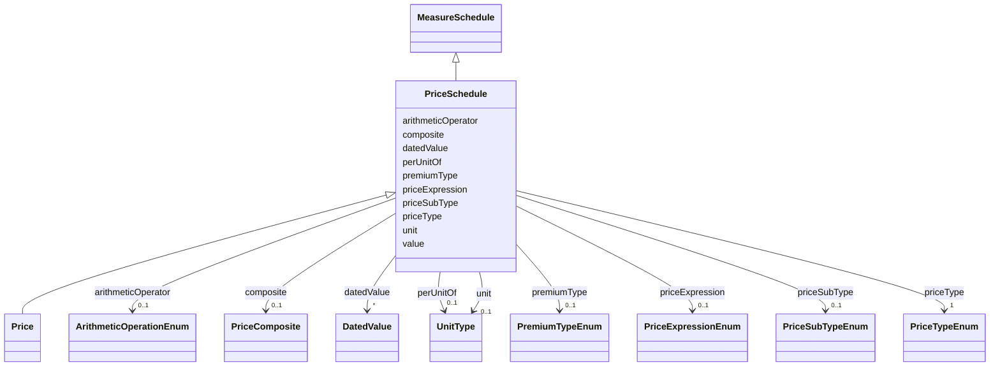

```mermaid
 classDiagram
    class PriceSchedule
    click PriceSchedule href "../PriceSchedule"
      MeasureSchedule <|-- PriceSchedule
        click MeasureSchedule href "../MeasureSchedule"
      

      PriceSchedule <|-- Price
        click Price href "../Price"
      

      PriceSchedule : arithmeticOperator
        
          
    
        
        
        PriceSchedule --> "0..1" ArithmeticOperationEnum : arithmeticOperator
        click ArithmeticOperationEnum href "../ArithmeticOperationEnum"
    

        
      PriceSchedule : composite
        
          
    
        
        
        PriceSchedule --> "0..1" PriceComposite : composite
        click PriceComposite href "../PriceComposite"
    

        
      PriceSchedule : datedValue
        
          
    
        
        
        PriceSchedule --> "*" DatedValue : datedValue
        click DatedValue href "../DatedValue"
    

        
      PriceSchedule : perUnitOf
        
          
    
        
        
        PriceSchedule --> "0..1" UnitType : perUnitOf
        click UnitType href "../UnitType"
    

        
      PriceSchedule : premiumType
        
          
    
        
        
        PriceSchedule --> "0..1" PremiumTypeEnum : premiumType
        click PremiumTypeEnum href "../PremiumTypeEnum"
    

        
      PriceSchedule : priceExpression
        
          
    
        
        
        PriceSchedule --> "0..1" PriceExpressionEnum : priceExpression
        click PriceExpressionEnum href "../PriceExpressionEnum"
    

        
      PriceSchedule : priceSubType
        
          
    
        
        
        PriceSchedule --> "0..1" PriceSubTypeEnum : priceSubType
        click PriceSubTypeEnum href "../PriceSubTypeEnum"
    

        
      PriceSchedule : priceType
        
          
    
        
        
        PriceSchedule --> "1" PriceTypeEnum : priceType
        click PriceTypeEnum href "../PriceTypeEnum"
    

        
      PriceSchedule : unit
        
          
    
        
        
        PriceSchedule --> "0..1" UnitType : unit
        click UnitType href "../UnitType"
    

        
      PriceSchedule : value
        
      
```
