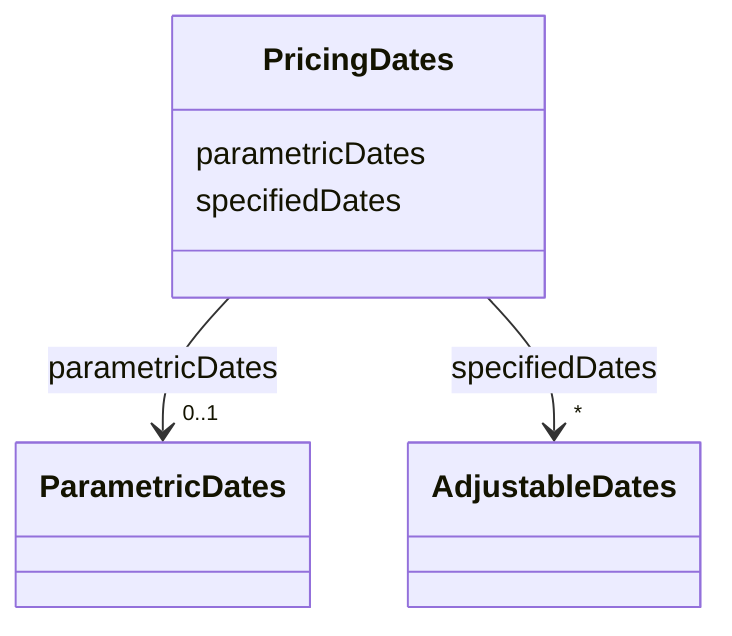

```mermaid
 classDiagram
    class PricingDates
    click PricingDates href "../PricingDates"
      PricingDates : parametricDates
        
          
    
        
        
        PricingDates --> "0..1" ParametricDates : parametricDates
        click ParametricDates href "../ParametricDates"
    

        
      PricingDates : specifiedDates
        
          
    
        
        
        PricingDates --> "*" AdjustableDates : specifiedDates
        click AdjustableDates href "../AdjustableDates"
    

        
      
```
