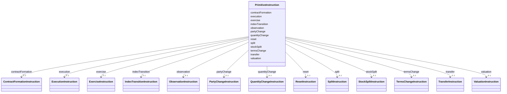

```mermaid
 classDiagram
    class PrimitiveInstruction
    click PrimitiveInstruction href "../PrimitiveInstruction"
      PrimitiveInstruction : contractFormation
        
          
    
        
        
        PrimitiveInstruction --> "0..1" ContractFormationInstruction : contractFormation
        click ContractFormationInstruction href "../ContractFormationInstruction"
    

        
      PrimitiveInstruction : execution
        
          
    
        
        
        PrimitiveInstruction --> "0..1" ExecutionInstruction : execution
        click ExecutionInstruction href "../ExecutionInstruction"
    

        
      PrimitiveInstruction : exercise
        
          
    
        
        
        PrimitiveInstruction --> "0..1" ExerciseInstruction : exercise
        click ExerciseInstruction href "../ExerciseInstruction"
    

        
      PrimitiveInstruction : indexTransition
        
          
    
        
        
        PrimitiveInstruction --> "0..1" IndexTransitionInstruction : indexTransition
        click IndexTransitionInstruction href "../IndexTransitionInstruction"
    

        
      PrimitiveInstruction : observation
        
          
    
        
        
        PrimitiveInstruction --> "0..1" ObservationInstruction : observation
        click ObservationInstruction href "../ObservationInstruction"
    

        
      PrimitiveInstruction : partyChange
        
          
    
        
        
        PrimitiveInstruction --> "0..1" PartyChangeInstruction : partyChange
        click PartyChangeInstruction href "../PartyChangeInstruction"
    

        
      PrimitiveInstruction : quantityChange
        
          
    
        
        
        PrimitiveInstruction --> "0..1" QuantityChangeInstruction : quantityChange
        click QuantityChangeInstruction href "../QuantityChangeInstruction"
    

        
      PrimitiveInstruction : reset
        
          
    
        
        
        PrimitiveInstruction --> "0..1" ResetInstruction : reset
        click ResetInstruction href "../ResetInstruction"
    

        
      PrimitiveInstruction : split
        
          
    
        
        
        PrimitiveInstruction --> "0..1" SplitInstruction : split
        click SplitInstruction href "../SplitInstruction"
    

        
      PrimitiveInstruction : stockSplit
        
          
    
        
        
        PrimitiveInstruction --> "0..1" StockSplitInstruction : stockSplit
        click StockSplitInstruction href "../StockSplitInstruction"
    

        
      PrimitiveInstruction : termsChange
        
          
    
        
        
        PrimitiveInstruction --> "0..1" TermsChangeInstruction : termsChange
        click TermsChangeInstruction href "../TermsChangeInstruction"
    

        
      PrimitiveInstruction : transfer
        
          
    
        
        
        PrimitiveInstruction --> "0..1" TransferInstruction : transfer
        click TransferInstruction href "../TransferInstruction"
    

        
      PrimitiveInstruction : valuation
        
          
    
        
        
        PrimitiveInstruction --> "0..1" ValuationInstruction : valuation
        click ValuationInstruction href "../ValuationInstruction"
    

        
      
```
