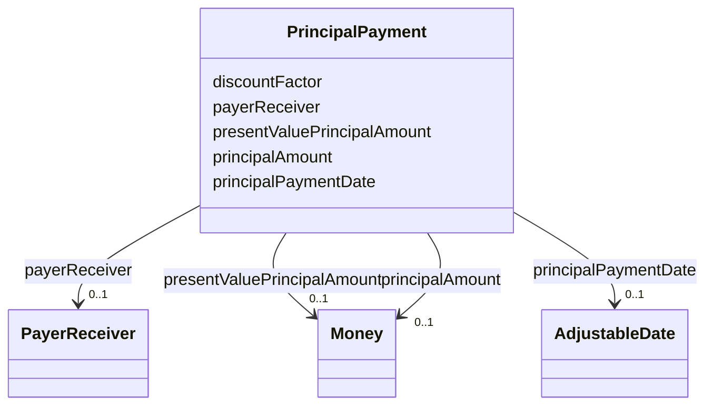

```mermaid
 classDiagram
    class PrincipalPayment
    click PrincipalPayment href "../PrincipalPayment"
      PrincipalPayment : discountFactor
        
      PrincipalPayment : payerReceiver
        
          
    
        
        
        PrincipalPayment --> "0..1" PayerReceiver : payerReceiver
        click PayerReceiver href "../PayerReceiver"
    

        
      PrincipalPayment : presentValuePrincipalAmount
        
          
    
        
        
        PrincipalPayment --> "0..1" Money : presentValuePrincipalAmount
        click Money href "../Money"
    

        
      PrincipalPayment : principalAmount
        
          
    
        
        
        PrincipalPayment --> "0..1" Money : principalAmount
        click Money href "../Money"
    

        
      PrincipalPayment : principalPaymentDate
        
          
    
        
        
        PrincipalPayment --> "0..1" AdjustableDate : principalPaymentDate
        click AdjustableDate href "../AdjustableDate"
    

        
      
```
