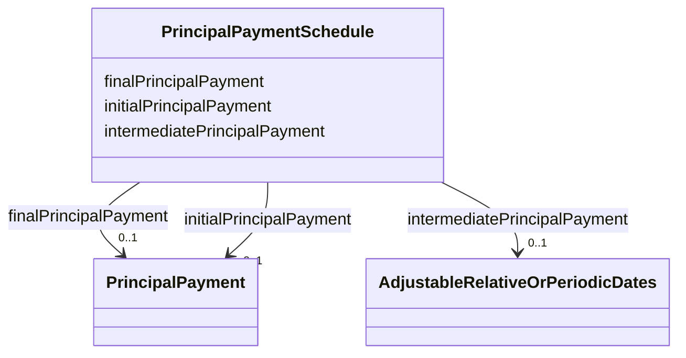

```mermaid
 classDiagram
    class PrincipalPaymentSchedule
    click PrincipalPaymentSchedule href "../PrincipalPaymentSchedule"
      PrincipalPaymentSchedule : finalPrincipalPayment
        
          
    
        
        
        PrincipalPaymentSchedule --> "0..1" PrincipalPayment : finalPrincipalPayment
        click PrincipalPayment href "../PrincipalPayment"
    

        
      PrincipalPaymentSchedule : initialPrincipalPayment
        
          
    
        
        
        PrincipalPaymentSchedule --> "0..1" PrincipalPayment : initialPrincipalPayment
        click PrincipalPayment href "../PrincipalPayment"
    

        
      PrincipalPaymentSchedule : intermediatePrincipalPayment
        
          
    
        
        
        PrincipalPaymentSchedule --> "0..1" AdjustableRelativeOrPeriodicDates : intermediatePrincipalPayment
        click AdjustableRelativeOrPeriodicDates href "../AdjustableRelativeOrPeriodicDates"
    

        
      
```
