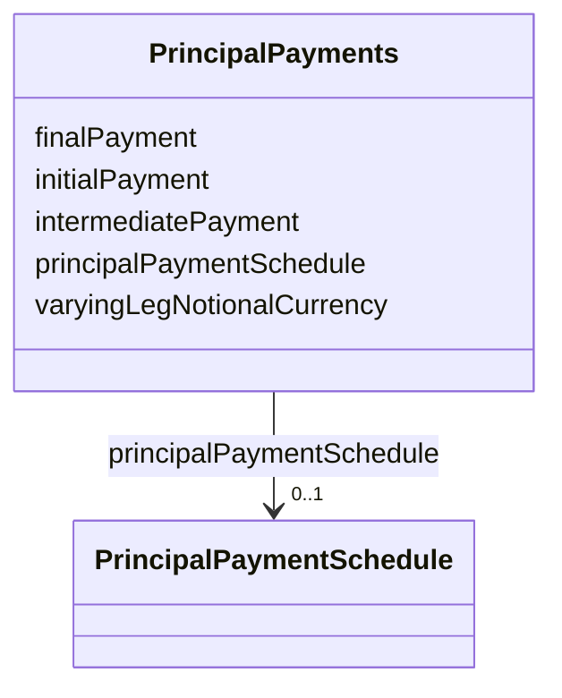

```mermaid
 classDiagram
    class PrincipalPayments
    click PrincipalPayments href "../PrincipalPayments"
      PrincipalPayments : finalPayment
        
      PrincipalPayments : initialPayment
        
      PrincipalPayments : intermediatePayment
        
      PrincipalPayments : principalPaymentSchedule
        
          
    
        
        
        PrincipalPayments --> "0..1" PrincipalPaymentSchedule : principalPaymentSchedule
        click PrincipalPaymentSchedule href "../PrincipalPaymentSchedule"
    

        
      PrincipalPayments : varyingLegNotionalCurrency
        
      
```
