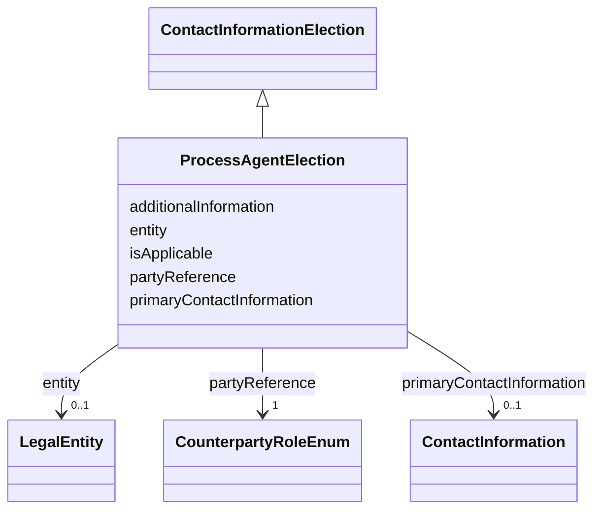

```mermaid
 classDiagram
    class ProcessAgentElection
    click ProcessAgentElection href "../ProcessAgentElection"
      ContactInformationElection <|-- ProcessAgentElection
        click ContactInformationElection href "../ContactInformationElection"
      
      ProcessAgentElection : additionalInformation
        
      ProcessAgentElection : entity
        
          
    
        
        
        ProcessAgentElection --> "0..1" LegalEntity : entity
        click LegalEntity href "../LegalEntity"
    

        
      ProcessAgentElection : isApplicable
        
      ProcessAgentElection : partyReference
        
          
    
        
        
        ProcessAgentElection --> "1" CounterpartyRoleEnum : partyReference
        click CounterpartyRoleEnum href "../CounterpartyRoleEnum"
    

        
      ProcessAgentElection : primaryContactInformation
        
          
    
        
        
        ProcessAgentElection --> "0..1" ContactInformation : primaryContactInformation
        click ContactInformation href "../ContactInformation"
    

        
      
```
