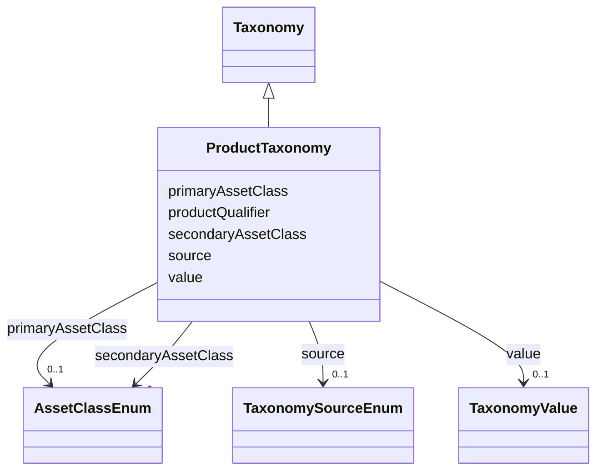

```mermaid
 classDiagram
    class ProductTaxonomy
    click ProductTaxonomy href "../ProductTaxonomy"
      Taxonomy <|-- ProductTaxonomy
        click Taxonomy href "../Taxonomy"
      
      ProductTaxonomy : primaryAssetClass
        
          
    
        
        
        ProductTaxonomy --> "0..1" AssetClassEnum : primaryAssetClass
        click AssetClassEnum href "../AssetClassEnum"
    

        
      ProductTaxonomy : productQualifier
        
      ProductTaxonomy : secondaryAssetClass
        
          
    
        
        
        ProductTaxonomy --> "*" AssetClassEnum : secondaryAssetClass
        click AssetClassEnum href "../AssetClassEnum"
    

        
      ProductTaxonomy : source
        
          
    
        
        
        ProductTaxonomy --> "0..1" TaxonomySourceEnum : source
        click TaxonomySourceEnum href "../TaxonomySourceEnum"
    

        
      ProductTaxonomy : value
        
          
    
        
        
        ProductTaxonomy --> "0..1" TaxonomyValue : value
        click TaxonomyValue href "../TaxonomyValue"
    

        
      
```
