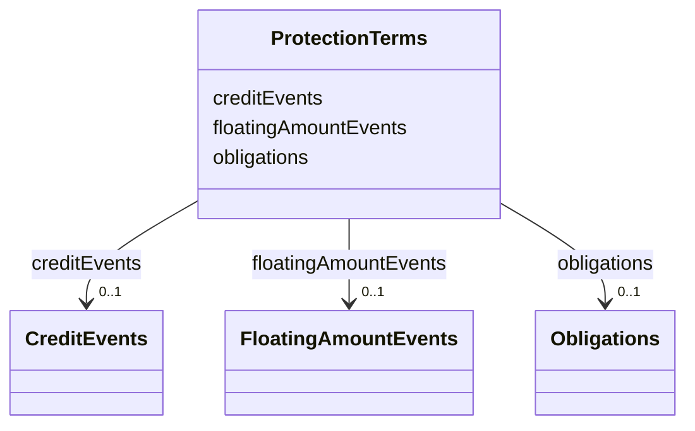

```mermaid
 classDiagram
    class ProtectionTerms
    click ProtectionTerms href "../ProtectionTerms"
      ProtectionTerms : creditEvents
        
          
    
        
        
        ProtectionTerms --> "0..1" CreditEvents : creditEvents
        click CreditEvents href "../CreditEvents"
    

        
      ProtectionTerms : floatingAmountEvents
        
          
    
        
        
        ProtectionTerms --> "0..1" FloatingAmountEvents : floatingAmountEvents
        click FloatingAmountEvents href "../FloatingAmountEvents"
    

        
      ProtectionTerms : obligations
        
          
    
        
        
        ProtectionTerms --> "0..1" Obligations : obligations
        click Obligations href "../Obligations"
    

        
      
```
