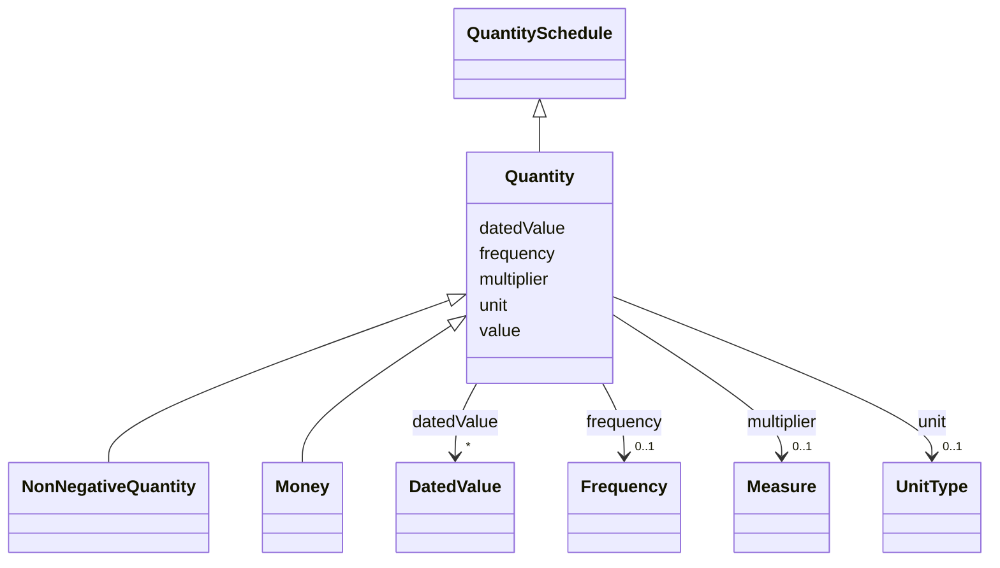

```mermaid
 classDiagram
    class Quantity
    click Quantity href "../Quantity"
      QuantitySchedule <|-- Quantity
        click QuantitySchedule href "../QuantitySchedule"
      

      Quantity <|-- NonNegativeQuantity
        click NonNegativeQuantity href "../NonNegativeQuantity"
      Quantity <|-- Money
        click Money href "../Money"
      

      Quantity : datedValue
        
          
    
        
        
        Quantity --> "*" DatedValue : datedValue
        click DatedValue href "../DatedValue"
    

        
      Quantity : frequency
        
          
    
        
        
        Quantity --> "0..1" Frequency : frequency
        click Frequency href "../Frequency"
    

        
      Quantity : multiplier
        
          
    
        
        
        Quantity --> "0..1" Measure : multiplier
        click Measure href "../Measure"
    

        
      Quantity : unit
        
          
    
        
        
        Quantity --> "0..1" UnitType : unit
        click UnitType href "../UnitType"
    

        
      Quantity : value
        
      
```
