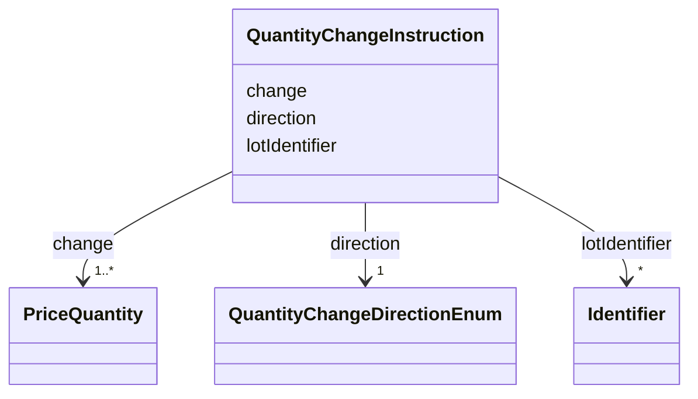

```mermaid
 classDiagram
    class QuantityChangeInstruction
    click QuantityChangeInstruction href "../QuantityChangeInstruction"
      QuantityChangeInstruction : change
        
          
    
        
        
        QuantityChangeInstruction --> "1..*" PriceQuantity : change
        click PriceQuantity href "../PriceQuantity"
    

        
      QuantityChangeInstruction : direction
        
          
    
        
        
        QuantityChangeInstruction --> "1" QuantityChangeDirectionEnum : direction
        click QuantityChangeDirectionEnum href "../QuantityChangeDirectionEnum"
    

        
      QuantityChangeInstruction : lotIdentifier
        
          
    
        
        
        QuantityChangeInstruction --> "*" Identifier : lotIdentifier
        click Identifier href "../Identifier"
    

        
      
```
