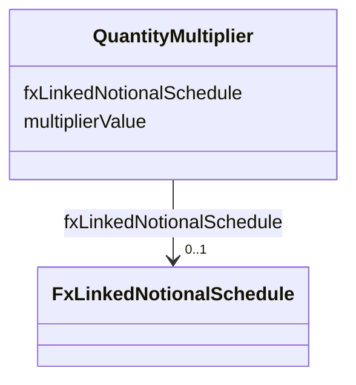

```mermaid
 classDiagram
    class QuantityMultiplier
    click QuantityMultiplier href "../QuantityMultiplier"
      QuantityMultiplier : fxLinkedNotionalSchedule
        
          
    
        
        
        QuantityMultiplier --> "0..1" FxLinkedNotionalSchedule : fxLinkedNotionalSchedule
        click FxLinkedNotionalSchedule href "../FxLinkedNotionalSchedule"
    

        
      QuantityMultiplier : multiplierValue
        
      
```
