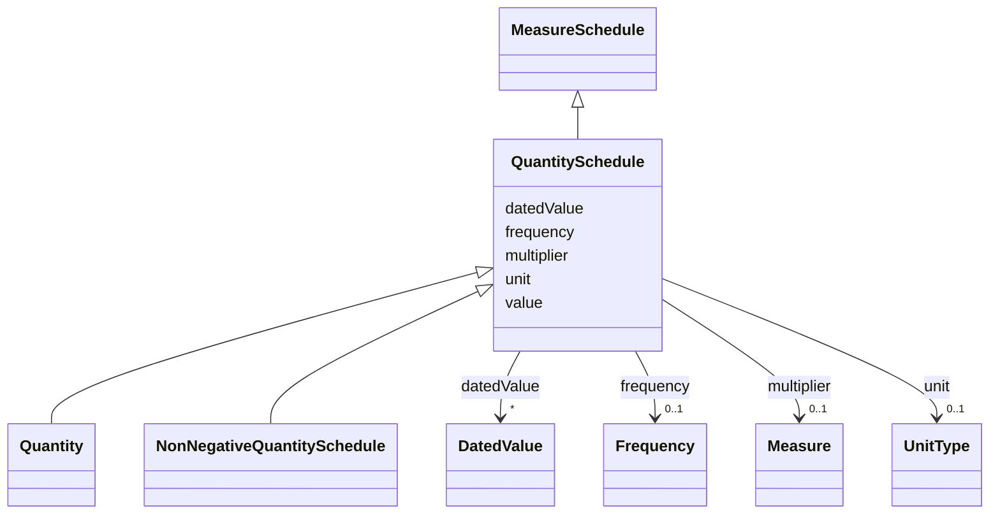

```mermaid
 classDiagram
    class QuantitySchedule
    click QuantitySchedule href "../QuantitySchedule"
      MeasureSchedule <|-- QuantitySchedule
        click MeasureSchedule href "../MeasureSchedule"
      

      QuantitySchedule <|-- Quantity
        click Quantity href "../Quantity"
      QuantitySchedule <|-- NonNegativeQuantitySchedule
        click NonNegativeQuantitySchedule href "../NonNegativeQuantitySchedule"
      

      QuantitySchedule : datedValue
        
          
    
        
        
        QuantitySchedule --> "*" DatedValue : datedValue
        click DatedValue href "../DatedValue"
    

        
      QuantitySchedule : frequency
        
          
    
        
        
        QuantitySchedule --> "0..1" Frequency : frequency
        click Frequency href "../Frequency"
    

        
      QuantitySchedule : multiplier
        
          
    
        
        
        QuantitySchedule --> "0..1" Measure : multiplier
        click Measure href "../Measure"
    

        
      QuantitySchedule : unit
        
          
    
        
        
        QuantitySchedule --> "0..1" UnitType : unit
        click UnitType href "../UnitType"
    

        
      QuantitySchedule : value
        
      
```
