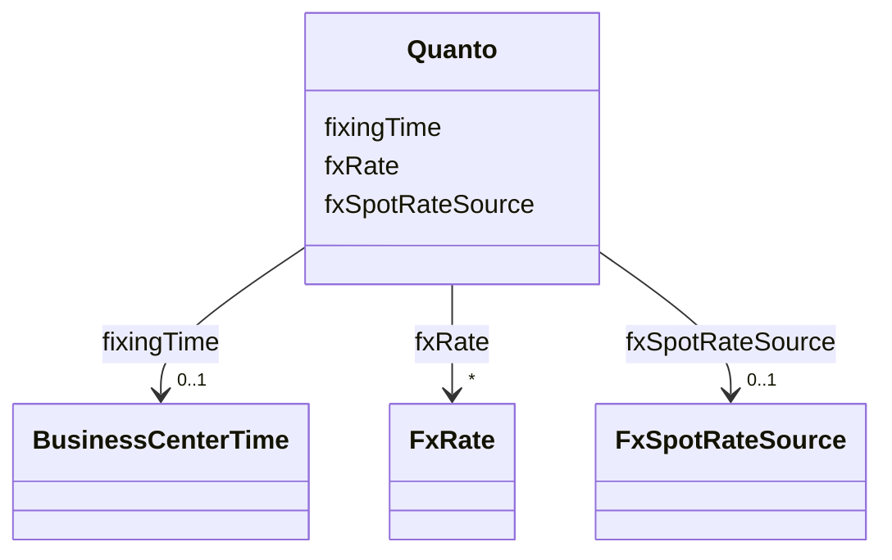

```mermaid
 classDiagram
    class Quanto
    click Quanto href "../Quanto"
      Quanto : fixingTime
        
          
    
        
        
        Quanto --> "0..1" BusinessCenterTime : fixingTime
        click BusinessCenterTime href "../BusinessCenterTime"
    

        
      Quanto : fxRate
        
          
    
        
        
        Quanto --> "*" FxRate : fxRate
        click FxRate href "../FxRate"
    

        
      Quanto : fxSpotRateSource
        
          
    
        
        
        Quanto --> "0..1" FxSpotRateSource : fxSpotRateSource
        click FxSpotRateSource href "../FxSpotRateSource"
    

        
      
```
