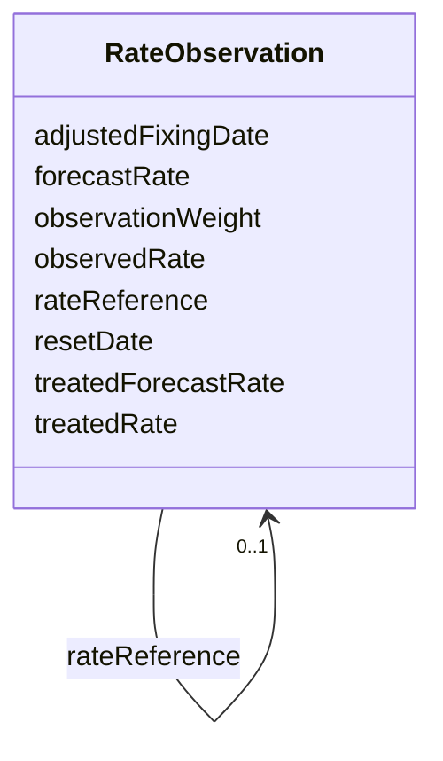

```mermaid
 classDiagram
    class RateObservation
    click RateObservation href "../RateObservation"
      RateObservation : adjustedFixingDate
        
      RateObservation : forecastRate
        
      RateObservation : observationWeight
        
      RateObservation : observedRate
        
      RateObservation : rateReference
        
          
    
        
        
        RateObservation --> "0..1" RateObservation : rateReference
        click RateObservation href "../RateObservation"
    

        
      RateObservation : resetDate
        
      RateObservation : treatedForecastRate
        
      RateObservation : treatedRate
        
      
```
