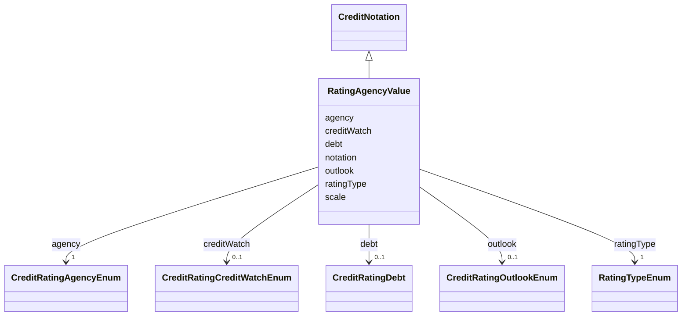

```mermaid
 classDiagram
    class RatingAgencyValue
    click RatingAgencyValue href "../RatingAgencyValue"
      CreditNotation <|-- RatingAgencyValue
        click CreditNotation href "../CreditNotation"
      
      RatingAgencyValue : agency
        
          
    
        
        
        RatingAgencyValue --> "1" CreditRatingAgencyEnum : agency
        click CreditRatingAgencyEnum href "../CreditRatingAgencyEnum"
    

        
      RatingAgencyValue : creditWatch
        
          
    
        
        
        RatingAgencyValue --> "0..1" CreditRatingCreditWatchEnum : creditWatch
        click CreditRatingCreditWatchEnum href "../CreditRatingCreditWatchEnum"
    

        
      RatingAgencyValue : debt
        
          
    
        
        
        RatingAgencyValue --> "0..1" CreditRatingDebt : debt
        click CreditRatingDebt href "../CreditRatingDebt"
    

        
      RatingAgencyValue : notation
        
      RatingAgencyValue : outlook
        
          
    
        
        
        RatingAgencyValue --> "0..1" CreditRatingOutlookEnum : outlook
        click CreditRatingOutlookEnum href "../CreditRatingOutlookEnum"
    

        
      RatingAgencyValue : ratingType
        
          
    
        
        
        RatingAgencyValue --> "1" RatingTypeEnum : ratingType
        click RatingTypeEnum href "../RatingTypeEnum"
    

        
      RatingAgencyValue : scale
        
      
```
