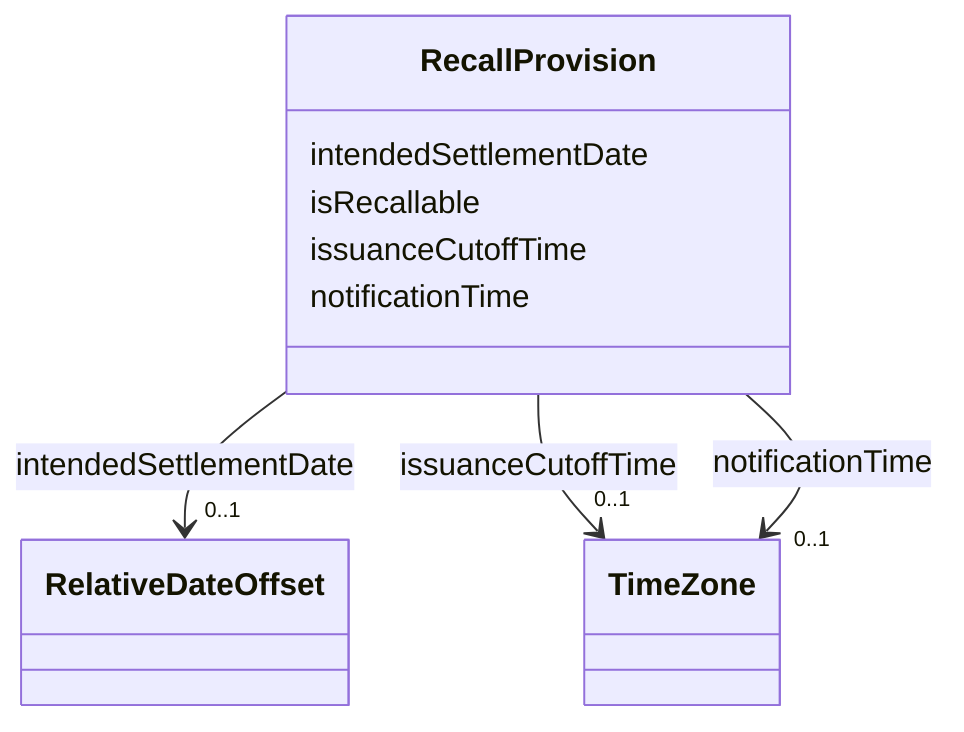

```mermaid
 classDiagram
    class RecallProvision
    click RecallProvision href "../RecallProvision"
      RecallProvision : intendedSettlementDate
        
          
    
        
        
        RecallProvision --> "0..1" RelativeDateOffset : intendedSettlementDate
        click RelativeDateOffset href "../RelativeDateOffset"
    

        
      RecallProvision : isRecallable
        
      RecallProvision : issuanceCutoffTime
        
          
    
        
        
        RecallProvision --> "0..1" TimeZone : issuanceCutoffTime
        click TimeZone href "../TimeZone"
    

        
      RecallProvision : notificationTime
        
          
    
        
        
        RecallProvision --> "0..1" TimeZone : notificationTime
        click TimeZone href "../TimeZone"
    

        
      
```
