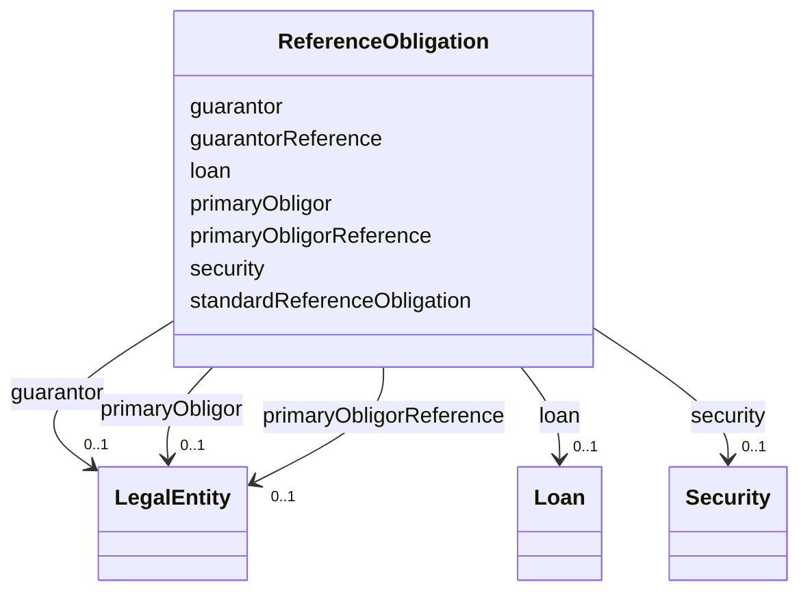

```mermaid
 classDiagram
    class ReferenceObligation
    click ReferenceObligation href "../ReferenceObligation"
      ReferenceObligation : guarantor
        
          
    
        
        
        ReferenceObligation --> "0..1" LegalEntity : guarantor
        click LegalEntity href "../LegalEntity"
    

        
      ReferenceObligation : guarantorReference
        
      ReferenceObligation : loan
        
          
    
        
        
        ReferenceObligation --> "0..1" Loan : loan
        click Loan href "../Loan"
    

        
      ReferenceObligation : primaryObligor
        
          
    
        
        
        ReferenceObligation --> "0..1" LegalEntity : primaryObligor
        click LegalEntity href "../LegalEntity"
    

        
      ReferenceObligation : primaryObligorReference
        
          
    
        
        
        ReferenceObligation --> "0..1" LegalEntity : primaryObligorReference
        click LegalEntity href "../LegalEntity"
    

        
      ReferenceObligation : security
        
          
    
        
        
        ReferenceObligation --> "0..1" Security : security
        click Security href "../Security"
    

        
      ReferenceObligation : standardReferenceObligation
        
      
```
