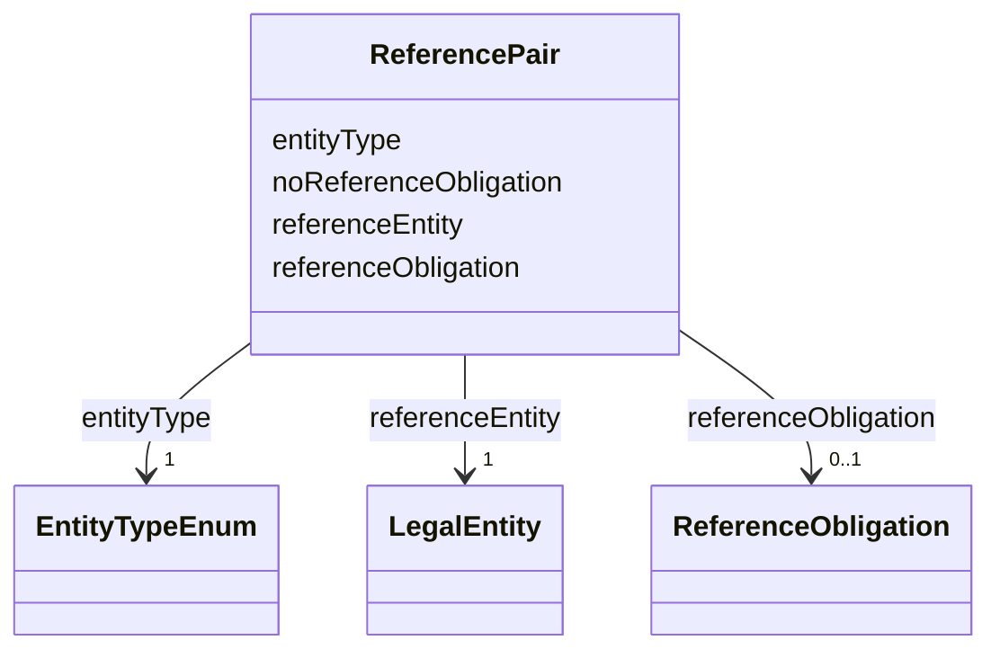

```mermaid
 classDiagram
    class ReferencePair
    click ReferencePair href "../ReferencePair"
      ReferencePair : entityType
        
          
    
        
        
        ReferencePair --> "1" EntityTypeEnum : entityType
        click EntityTypeEnum href "../EntityTypeEnum"
    

        
      ReferencePair : noReferenceObligation
        
      ReferencePair : referenceEntity
        
          
    
        
        
        ReferencePair --> "1" LegalEntity : referenceEntity
        click LegalEntity href "../LegalEntity"
    

        
      ReferencePair : referenceObligation
        
          
    
        
        
        ReferencePair --> "0..1" ReferenceObligation : referenceObligation
        click ReferenceObligation href "../ReferenceObligation"
    

        
      
```
