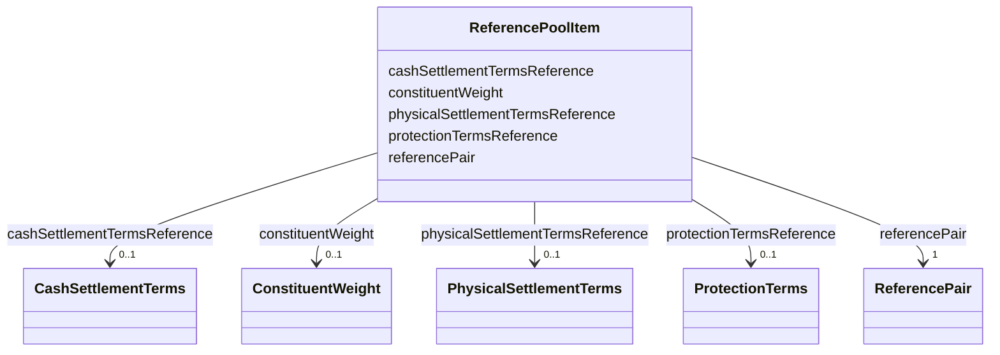

```mermaid
 classDiagram
    class ReferencePoolItem
    click ReferencePoolItem href "../ReferencePoolItem"
      ReferencePoolItem : cashSettlementTermsReference
        
          
    
        
        
        ReferencePoolItem --> "0..1" CashSettlementTerms : cashSettlementTermsReference
        click CashSettlementTerms href "../CashSettlementTerms"
    

        
      ReferencePoolItem : constituentWeight
        
          
    
        
        
        ReferencePoolItem --> "0..1" ConstituentWeight : constituentWeight
        click ConstituentWeight href "../ConstituentWeight"
    

        
      ReferencePoolItem : physicalSettlementTermsReference
        
          
    
        
        
        ReferencePoolItem --> "0..1" PhysicalSettlementTerms : physicalSettlementTermsReference
        click PhysicalSettlementTerms href "../PhysicalSettlementTerms"
    

        
      ReferencePoolItem : protectionTermsReference
        
          
    
        
        
        ReferencePoolItem --> "0..1" ProtectionTerms : protectionTermsReference
        click ProtectionTerms href "../ProtectionTerms"
    

        
      ReferencePoolItem : referencePair
        
          
    
        
        
        ReferencePoolItem --> "1" ReferencePair : referencePair
        click ReferencePair href "../ReferencePair"
    

        
      
```
