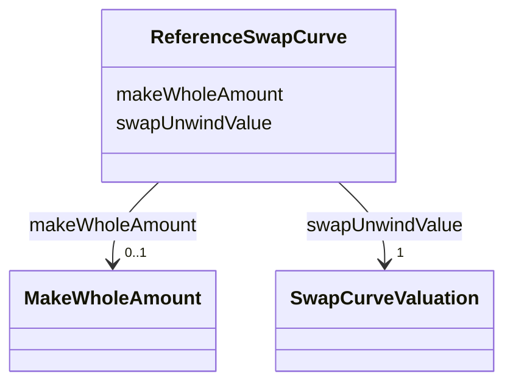

```mermaid
 classDiagram
    class ReferenceSwapCurve
    click ReferenceSwapCurve href "../ReferenceSwapCurve"
      ReferenceSwapCurve : makeWholeAmount
        
          
    
        
        
        ReferenceSwapCurve --> "0..1" MakeWholeAmount : makeWholeAmount
        click MakeWholeAmount href "../MakeWholeAmount"
    

        
      ReferenceSwapCurve : swapUnwindValue
        
          
    
        
        
        ReferenceSwapCurve --> "1" SwapCurveValuation : swapUnwindValue
        click SwapCurveValuation href "../SwapCurveValuation"
    

        
      
```
