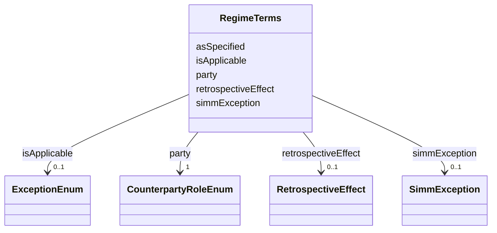

```mermaid
 classDiagram
    class RegimeTerms
    click RegimeTerms href "../RegimeTerms"
      RegimeTerms : asSpecified
        
      RegimeTerms : isApplicable
        
          
    
        
        
        RegimeTerms --> "0..1" ExceptionEnum : isApplicable
        click ExceptionEnum href "../ExceptionEnum"
    

        
      RegimeTerms : party
        
          
    
        
        
        RegimeTerms --> "1" CounterpartyRoleEnum : party
        click CounterpartyRoleEnum href "../CounterpartyRoleEnum"
    

        
      RegimeTerms : retrospectiveEffect
        
          
    
        
        
        RegimeTerms --> "0..1" RetrospectiveEffect : retrospectiveEffect
        click RetrospectiveEffect href "../RetrospectiveEffect"
    

        
      RegimeTerms : simmException
        
          
    
        
        
        RegimeTerms --> "0..1" SimmException : simmException
        click SimmException href "../SimmException"
    

        
      
```
