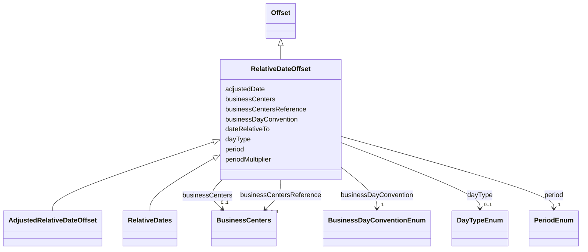

```mermaid
 classDiagram
    class RelativeDateOffset
    click RelativeDateOffset href "../RelativeDateOffset"
      Offset <|-- RelativeDateOffset
        click Offset href "../Offset"
      

      RelativeDateOffset <|-- AdjustedRelativeDateOffset
        click AdjustedRelativeDateOffset href "../AdjustedRelativeDateOffset"
      RelativeDateOffset <|-- RelativeDates
        click RelativeDates href "../RelativeDates"
      

      RelativeDateOffset : adjustedDate
        
      RelativeDateOffset : businessCenters
        
          
    
        
        
        RelativeDateOffset --> "0..1" BusinessCenters : businessCenters
        click BusinessCenters href "../BusinessCenters"
    

        
      RelativeDateOffset : businessCentersReference
        
          
    
        
        
        RelativeDateOffset --> "0..1" BusinessCenters : businessCentersReference
        click BusinessCenters href "../BusinessCenters"
    

        
      RelativeDateOffset : businessDayConvention
        
          
    
        
        
        RelativeDateOffset --> "1" BusinessDayConventionEnum : businessDayConvention
        click BusinessDayConventionEnum href "../BusinessDayConventionEnum"
    

        
      RelativeDateOffset : dateRelativeTo
        
      RelativeDateOffset : dayType
        
          
    
        
        
        RelativeDateOffset --> "0..1" DayTypeEnum : dayType
        click DayTypeEnum href "../DayTypeEnum"
    

        
      RelativeDateOffset : period
        
          
    
        
        
        RelativeDateOffset --> "1" PeriodEnum : period
        click PeriodEnum href "../PeriodEnum"
    

        
      RelativeDateOffset : periodMultiplier
        
      
```
