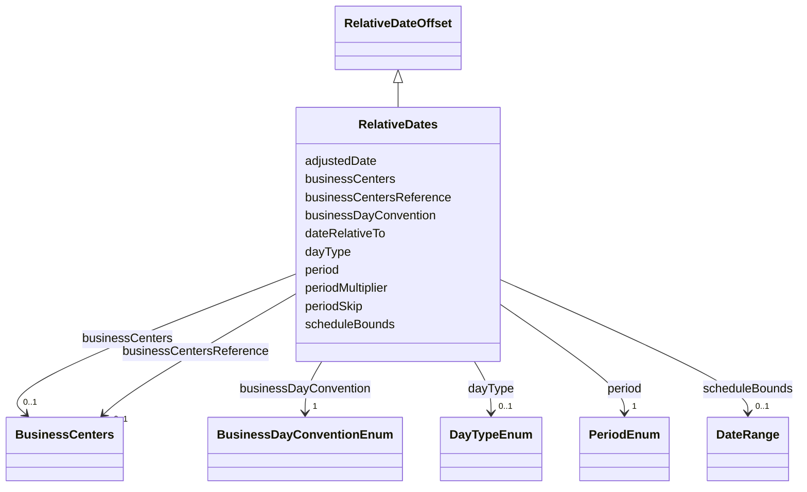

```mermaid
 classDiagram
    class RelativeDates
    click RelativeDates href "../RelativeDates"
      RelativeDateOffset <|-- RelativeDates
        click RelativeDateOffset href "../RelativeDateOffset"
      
      RelativeDates : adjustedDate
        
      RelativeDates : businessCenters
        
          
    
        
        
        RelativeDates --> "0..1" BusinessCenters : businessCenters
        click BusinessCenters href "../BusinessCenters"
    

        
      RelativeDates : businessCentersReference
        
          
    
        
        
        RelativeDates --> "0..1" BusinessCenters : businessCentersReference
        click BusinessCenters href "../BusinessCenters"
    

        
      RelativeDates : businessDayConvention
        
          
    
        
        
        RelativeDates --> "1" BusinessDayConventionEnum : businessDayConvention
        click BusinessDayConventionEnum href "../BusinessDayConventionEnum"
    

        
      RelativeDates : dateRelativeTo
        
      RelativeDates : dayType
        
          
    
        
        
        RelativeDates --> "0..1" DayTypeEnum : dayType
        click DayTypeEnum href "../DayTypeEnum"
    

        
      RelativeDates : period
        
          
    
        
        
        RelativeDates --> "1" PeriodEnum : period
        click PeriodEnum href "../PeriodEnum"
    

        
      RelativeDates : periodMultiplier
        
      RelativeDates : periodSkip
        
      RelativeDates : scheduleBounds
        
          
    
        
        
        RelativeDates --> "0..1" DateRange : scheduleBounds
        click DateRange href "../DateRange"
    

        
      
```
