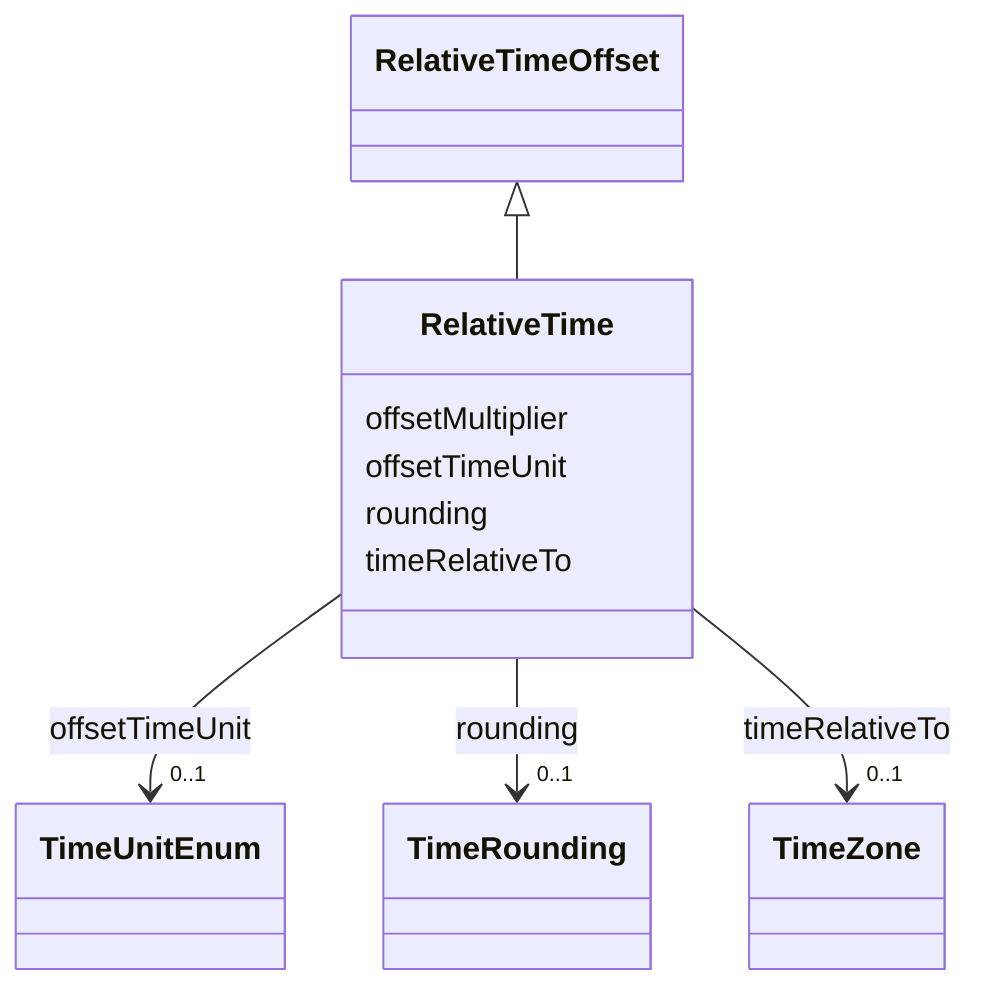

```mermaid
 classDiagram
    class RelativeTime
    click RelativeTime href "../RelativeTime"
      RelativeTimeOffset <|-- RelativeTime
        click RelativeTimeOffset href "../RelativeTimeOffset"
      
      RelativeTime : offsetMultiplier
        
      RelativeTime : offsetTimeUnit
        
          
    
        
        
        RelativeTime --> "0..1" TimeUnitEnum : offsetTimeUnit
        click TimeUnitEnum href "../TimeUnitEnum"
    

        
      RelativeTime : rounding
        
          
    
        
        
        RelativeTime --> "0..1" TimeRounding : rounding
        click TimeRounding href "../TimeRounding"
    

        
      RelativeTime : timeRelativeTo
        
          
    
        
        
        RelativeTime --> "0..1" TimeZone : timeRelativeTo
        click TimeZone href "../TimeZone"
    

        
      
```
