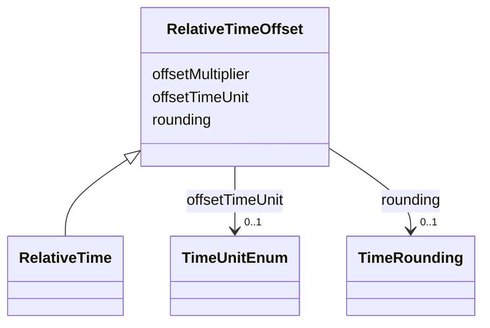

```mermaid
 classDiagram
    class RelativeTimeOffset
    click RelativeTimeOffset href "../RelativeTimeOffset"
      RelativeTimeOffset <|-- RelativeTime
        click RelativeTime href "../RelativeTime"
      
      RelativeTimeOffset : offsetMultiplier
        
      RelativeTimeOffset : offsetTimeUnit
        
          
    
        
        
        RelativeTimeOffset --> "0..1" TimeUnitEnum : offsetTimeUnit
        click TimeUnitEnum href "../TimeUnitEnum"
    

        
      RelativeTimeOffset : rounding
        
          
    
        
        
        RelativeTimeOffset --> "0..1" TimeRounding : rounding
        click TimeRounding href "../TimeRounding"
    

        
      
```
