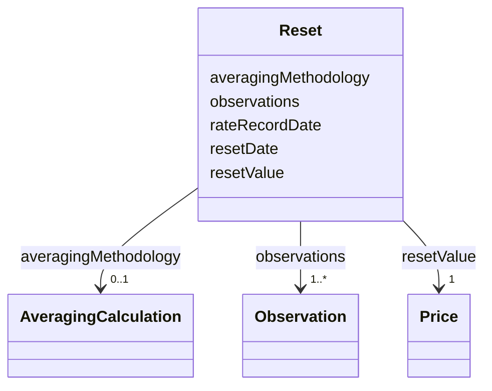

```mermaid
 classDiagram
    class Reset
    click Reset href "../Reset"
      Reset : averagingMethodology
        
          
    
        
        
        Reset --> "0..1" AveragingCalculation : averagingMethodology
        click AveragingCalculation href "../AveragingCalculation"
    

        
      Reset : observations
        
          
    
        
        
        Reset --> "1..*" Observation : observations
        click Observation href "../Observation"
    

        
      Reset : rateRecordDate
        
      Reset : resetDate
        
      Reset : resetValue
        
          
    
        
        
        Reset --> "1" Price : resetValue
        click Price href "../Price"
    

        
      
```
